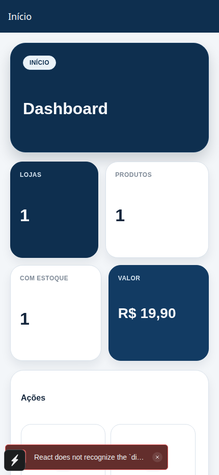
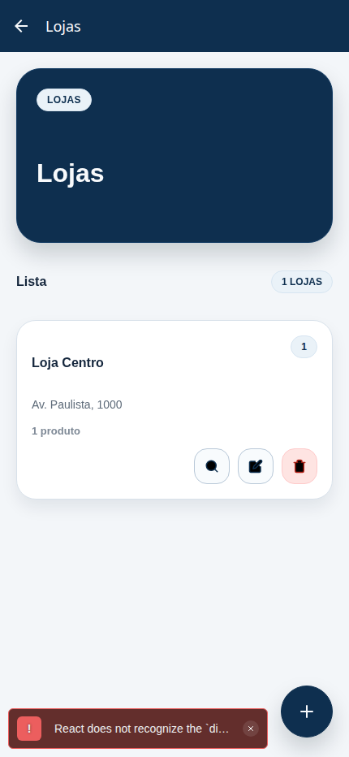
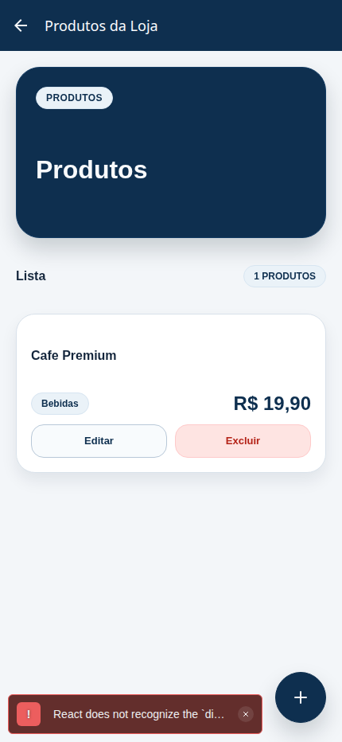

# Retail Hub Mobile

Aplicativo mobile desenvolvido em React Native com Expo para centralizar o cadastro de lojas e produtos de uma rede varejista. O projeto usa MirageJS para simular o back-end localmente, Zustand para cache global de dados e Gluestack UI para a interface.

## Stack e versões

- Node recomendado para desenvolvimento, build e CI: `>= 20.19.4`
- arquivo `.nvmrc` incluído com `20.19.4`
- campo `engines.node` configurado no `package.json`
- Expo: `~55.0.6`
- React: `19.2.0`
- React Native: `0.83.2`
- TypeScript: `~5.9.2`
- Expo Router: `~55.0.5`
- Gluestack UI: `@gluestack-ui/themed ^1.1.73`
- Zustand: `^5.0.12`
- MirageJS: `^0.1.48`

## Escopo entregue

- Dashboard inicial com indicadores de lojas, produtos, lojas com estoque e valor total mockado do catálogo
- Módulo de lojas com listagem, cadastro, edição e exclusão
- Abertura dos produtos vinculados a uma loja selecionada
- Módulo de produtos com listagem geral, listagem por loja, cadastro, edição e exclusão
- Cadastro de produto com vínculo obrigatório a uma loja
- Cache global com Zustand para evitar refetch desnecessário ao navegar entre telas
- Mock de API com MirageJS usando endpoints para `/stores` e `/products`
- Navegação com Expo Router
- Interface construída com Gluestack UI e tema visual corporativo
- Testes unitários e de interface com Jest + Testing Library React Native
- ESLint + Prettier configurados para manter padrão de código
- Pipeline de CI com GitHub Actions para validar lint, formatação, tipos, testes e build web em `push` na `main` e em `pull_request`

## Fluxo de dados

O fluxo principal do app está organizado assim:

`Tela -> service -> client -> MirageJS -> models -> in-memory-db`

Na interface:

- `src/zustand/store.ts` mantém o cache global de lojas
- `src/zustand/product.ts` mantém o cache global de produtos
- os dados são carregados na primeira hidratação e reutilizados nas próximas navegações
- após criar, editar ou excluir um registro, o cache global é atualizado sem necessidade de recarregar toda a aplicação

## Instalação

```bash
npm install
```

## Execução

```bash
nvm use
npx expo start
```

ou

```bash
npm run start
```

Atalhos por plataforma:

```bash
npm run android
npm run ios
npm run web
```

## Testes

```bash
npm run test
npm run test:ci
```

Cobertura atual de interface:

- cards de loja e produto
- formulário de loja
- formulário de produto

## Prints

### Dashboard



### Lojas



### Produtos vinculados



## Qualidade de codigo

```bash
npm run lint
npm run lint:fix
npm run format
npm run format:check
```

## Mock de back-end

Nenhum processo separado precisa ser iniciado.

- em ambiente de desenvolvimento, o MirageJS sobe automaticamente no bootstrap do app
- a base da API mockada usa `https://mock.api.local`
- os dados ficam em memória e são recriados quando o app é reiniciado em desenvolvimento

Endpoints simulados:

- `GET /stores`
- `POST /stores`
- `PUT /stores/:storeId`
- `DELETE /stores/:storeId`
- `GET /stores/:storeId/products`
- `GET /products`
- `POST /products`
- `PUT /products/:productId`
- `DELETE /products/:productId`

## Estrutura principal

```text
app/
  _layout.tsx
  index.tsx
  products/
    index.tsx
    new.tsx
  stores/
    index.tsx
    new.tsx
    [storeId]/
      edit.tsx
      products/
        index.tsx
        new.tsx
        [productId]/
          edit.tsx

src/
  components/
    actions/
    icons/
    layout/
  features/
    dashboard/
    products/
    stores/
  lib/
    api/
  providers/
  server/
    mirage/
      dto/
      models/
      routes/
      seeds/
      utils/
  store/
  theme/
  zustand/
```

## Comandos úteis

```bash
npm run typecheck
npm run test
npm run build:web
```

## CI

O projeto possui uma workflow em `.github/workflows/ci.yaml` com execução em `push` na `main` e em `pull_request`.

Validações da pipeline:

- `npm ci`
- `npm run lint`
- `npm run format:check`
- `npm run typecheck`
- `npm run test:ci`
- `npm run build:web`

## Diferenciais possíveis para evolução

Os itens abaixo podem ser adicionados depois, mas não são necessários para executar a versão atual:

- busca e filtro de lojas e produtos
- persistência offline com AsyncStorage
- publicação com Expo
